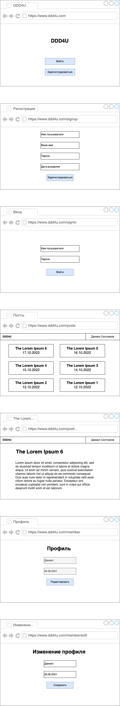

# Форум личной продуктивности

## Цель работы

Разработать многопользовательское клиент-серверное приложение с возможностью писать посты и комментарии к ним.

## Решаемая проблема / предоставляемая возможность

Многие люди активно работают над повышением собствнной эффективности. Разрабатываемый программный комплекс призван помочь им в этом.

## Функциональные требования

В разрабатываемом ПО необходимо предусмотреть следующий функционал.

- Управление аккаунтом;
- создание постов;
- добавление комментариев к постам.

## Use-case диаграмма

## Экраны будущего приложения

## ER диаграмма сущностей системы

