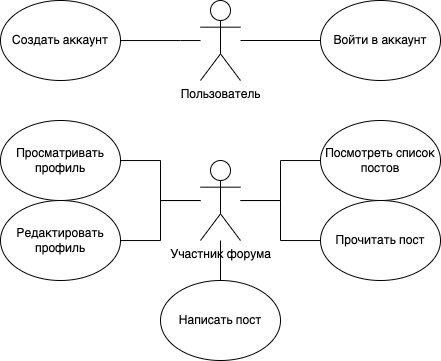
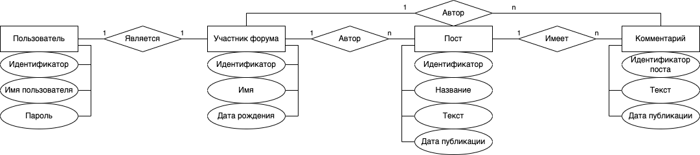

# Форум DDD (Технологический блог)

## Цель работы

Разработать многопользовательское клиент-серверное приложение с возможностью писать и читать посты.

## Решаемая проблема / предоставляемая возможность

Некоторым людям нежно обмениваться знаниями и опытом в DDD. Разрабатываемый программный комплекс призван помочь им в этом.

## Функциональные требования

В разрабатываемом ПО необходимо предусмотреть следующий функционал.

- Управление аккаунтом;
- создание постов;
- просмотр постов.

## Use-case диаграмма

## Экраны будущего приложения

## ER диаграмма сущностей системы

## Бенчмарки

### Без балансировки

### С балансировкой

